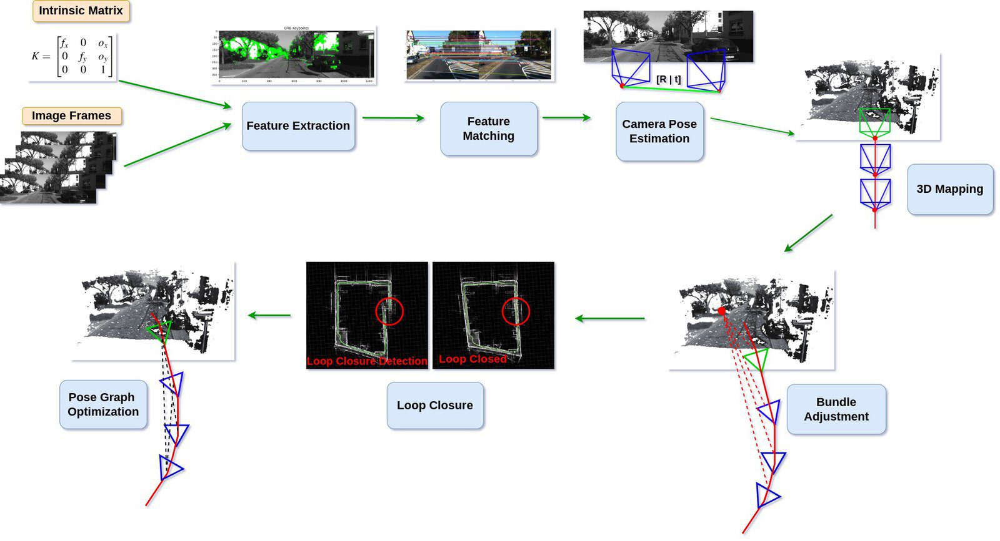

# COLMAP to Gaussian Splats

Ce projet regroupe les outils nécessaires pour produire des scènes 3D en *Gaussian Splatting* (3DGS) à partir de vidéos, de photographies ou de flux d'images issus des services [Panoramax](https://panoramax.fr). Il couvre quatre grandes étapes :

- **La photogrammétrie (SfM)** : reconstruction des caméras et du nuage de points 3D avec HLOC, COLMAP ou Spirula.
- **L'entraînement 3DGS** : génération et optimisation des gaussiennes avec Nerfstudio (Splatfacto) ou Spirula.
- **L'export et le géoréférencement** : production de fichiers `.splat`, `.ply` ou 3D Tiles, avec possibilité de géoréférencer les scènes à partir des coordonnées GPS des images (EXIF), d'une trajectoire GPS au format GPX ou de fichiers externes de positions.
- **La visualisation 3D** : un viewer web affiche les splats alignés avec des données externes : nuages LiDAR, bâtiments CityJSON (roofer), couches GeoJSON ou GeoPackage, et données COLMAP.

```text
Images → reconstruction des caméras et points 3D → entraînement 3DGS → export → visualisation
```

## 1. Qu’est-ce que le 3DGS ?

### 1.1. Qu’est-ce qu’un Gaussian Splat ?

Un Gaussian Splat représente une scène 3D par un ensemble de gaussiennes :
des ellipsoïdes colorés dotés d’une position, d’une taille, d’une orientation
et d’une opacité. Depuis un point de vue, elles sont projetées sur l’image puis
compositées pour produire le rendu.

Contrairement à un maillage composé de surfaces, cette représentation décrit
directement l’apparence de la scène depuis plusieurs points de vue. Une fois
entraîné, le modèle peut être rendu et exploré en temps réel sur un matériel
adapté.


### Principe général

```text
Images + modèle COLMAP
        ↓
Initialisation des gaussiennes avec le nuage de points
        ↓
Entraînement GPU (Splatfacto ou Spirula)
        ↓
Export → post-traitement éventuel → visualisation
```

COLMAP met en correspondance les images et estime les paramètres des caméras
ainsi qu’un nuage de points 3D clairsemé. L’entraînement ajuste les gaussiennes
pour rapprocher les vues synthétiques des images d’entrée.



## 2. Que fait ce projet ?

> **Pour bien démarrer, consultez le [guide utilisateur](doc/guide_utilisateur.md)** : il aide à choisir le parcours, le moteur d'entraînement et le pipeline adaptés à votre point de départ.

Le projet est organisé en outils indépendants pour la préparation des données COLMAP,
l'entraînement, l'export et le post-traitement, ainsi qu'en pipelines qui enchaînent ces étapes.

### Pipelines complets

Les pipelines images, vidéo et Panoramax, avec le choix du moteur d'entraînement,
sont décrits dans le [guide utilisateur](doc/guide_utilisateur.md#23-utiliser-un-pipeline-complet).

### Démarrer

Les défauts sont chargés automatiquement depuis `config/defaults/*.default.sh`, puis
`tools/<pipeline>/config.default.sh`. Un fichier de configuration ne contient que les surcharges :

```bash
cat > /chemin/config_image.sh <<'EOF'
#!/usr/bin/env bash
SFM_IMAGES_DIR="/chemin/images"
OUTPUT_DIR="/chemin/sortie"
EOF
```

Slurm (*Simple Linux Utility for Resource Management*) est un gestionnaire
de ressources et de tâches de calcul utilisé sur les clusters.

**Exécution directe, sans soumission Slurm** — les calculs tournent sur la
machine courante et les blocs sont entraînés successivement. Ces commandes
ne réservent aucune ressource Slurm, même si la configuration contient des
paramètres `SLURM_*` :

```bash
# Images locales → 3DGS
bash scripts/images_to_3dgs.sh /chemin/config_image.sh

# Panoramax → 3DGS
bash scripts/panoramax_to_3dgs.sh /chemin/config_panoramax.sh
```

**Soumission à un cluster Slurm** — utiliser les lanceurs `launch_*` ci-dessous
depuis le nœud de connexion. Ils lisent les ressources `SLURM_*` de la
configuration et appellent eux-mêmes `sbatch` : les calculs s'exécutent sur les
nœuds alloués, avec un GPU par bloc actif et au plus
`NUM_GPUS` blocs simultanés. Les lanceurs se démarrent avec
`bash`, pas avec `sbatch` ; c'est le choix du script `launch_*` qui déclenche
la soumission Slurm.

```bash
# Images locales → 3DGS
bash scripts/launch_images_to_3dgs.sh /chemin/config_image.sh

# Panoramax → 3DGS
bash scripts/launch_panoramax_to_3dgs.sh /chemin/config_panoramax.sh
```

Voir le [guide de lancement Bash / Slurm](doc/lancement_bash_slurm.md) et les
[exemples de configuration complète](scripts/README.md) pour les paramètres
commentés de chaque pipeline.

Les installations, données attendues, paramètres et sorties sont décrits dans
le README du pipeline choisi.

### Convertir et visualiser un splat en 3D Tiles

Le fichier `.splat` géoréférencé (repère ENU) se convertit en tileset 3D Tiles,
puis s'ouvre dans le viewer HTML avec fond OpenStreetMap. Prérequis, une fois :

```bash
npm install --global 3dgs-ply-3dtiles-converter
```

```bash
# Conversion (--georef-summary est facultatif)
python3 tools/export/export_3dtiles.py \
  --input /chemin/vers/scene.splat \
  --output-dir /chemin/vers/scene_tiles \
  --no-open-inspector

# Visualisation
bash tools/viewer/3dtiles/view.sh /chemin/vers/scene_tiles/tileset.json
```

Le `--georef-summary` est facultatif si le résumé se trouve à côté du `.splat` ; les règles de recherche et les options sont dans la [documentation 3D Tiles](tools/export/export_3dtiles.md). La visualisation est décrite dans la [documentation du viewer](tools/viewer/README.md).

### Documentation des outils

- [Exemples de commandes par usage](examples/README.md), dont la récupération d'un `.laz` IGN.
- [Préparation des images et modèles COLMAP](tools/prepare/README.md).
- [Images, orientations et LiDAR vers COLMAP](tools/sfm/README.md).
- [Poses caméra IGNF `.CON` + LiDAR `.LAZ` vers orientations](tools/con_laz_to_orientations/README.md).
- [Installation de Spirula](install/spirula/README.md).
- [Masques](tools/masks/README.md).
- [Export, filtrage et fusion](tools/export/README.md).
- [Recalage et nettoyage des gaussiennes avec un LiDAR LAS/LAZ](tools/lidar/README.md).
- [Rapports automatiques de durée des pipelines](tools/libs/python/PIPELINE_REPORT.md).
- [Nettoyage multivues du ciel](tools/export/clean_gs/README.md).
- [Visualisation](tools/viewer/README.md).
- [Conversion en 3D Tiles](tools/export/export_3dtiles.md).
