# Les splats gaussiens, une nouvelle manière de représenter nos données 3D

## 1. Un Gaussian Splat, c'est quoi ?
--

Pour représenter une scène en trois dimensions, on utilisait en général :
- **un maillage texturé** : une surface composée de triangles, sur laquelle sont projetées des images
- **un nuage de points** : des positions 3D, éventuellement accompagnées de couleurs

Récemment, deux approches paramétriques modernes se sont imposées :
a) **Les NeRF (Neural Radiance Fields)** :  un réseau neuronal encode la radiance (couleur + luminosité) en fonction de la position et de la direction d'observation.
- ✓ Qualité visuelle exceptionnelle
- ✗ Rendu très lent (secondes par image)

b) L**es 3D Gaussian Splatting** : la scène est décrite par un ensemble de **gaussiennes 3D** : des ellipsoïdes colorés avec une certaine opacité.
Chaque gaussienne possède :
une **position** dans l'espace ;
  - une **échelle** et une **rotation**, qui définissent sa forme et son orientation ;
  - une **opacité** ;
  - des **attributs de couleur**, pouvant représenter une apparence qui varie selon la direction d'observation.

  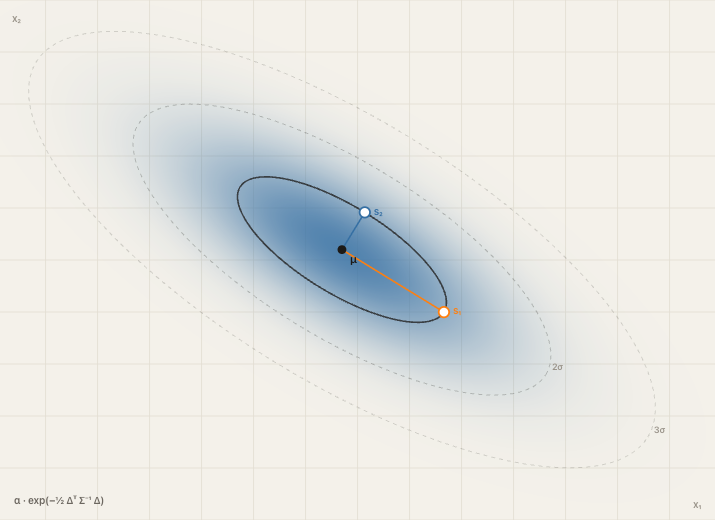 
  <em>Source : <a href="https://brunzema.github.io/visualizations/gaussian-splatting">A visual exploration of Gaussian Splatting — Paul Brunzema</a></em>

Le rendu peut alors se faire en **temps réel**, permettant une navigation 3D immersive avec une finesse de rendu très au-dessus des approches plus classiques.

[Démo interactive: Niseko Village — Snowy Ski Resort [Source : Splat Labs — Gaussian Splatting](https://cloud.splatlabs.ai/viewer/0729c1d5-8d65-4dbc-b4f4-a7ed4fbd6ce3)]

## 2. Pourquoi s'y intéresser maintenant ?
---

### 2.1 Maturité de la technologie : d'un sujet de recherche à une brique standardisée
Les Gaussian Splats ne sont plus une technique expérimentale confinée à la recherche académique. Ils s'imposent comme **le paradigme dominant pour la visualisation 3D immersive et interactive** à grande échelle.
**Signaux forts de maturité technologique :**
- **Standardisation dans l'écosystème glTF** : le groupe **Khronos**, qui définit la plupart des standards de rendu graphique 3D, a annoncé l'intégration des Gaussian Splats comme primitive 3D officielle dans les standards web et géospatiaux.
- **Intégration dans les workflows de streaming géospatial** : **Cesium** offre désormais un support natif des Gaussian Splats dans les **3D Tiles**, avec gestion hiérarchique du LOD (Level of Detail) pour le streaming progressif de scènes massives.
- **Exploration des formats 360°** : des outils comme **360 Splat Pro** appliquent la technologie aux panoramas, ouvrant de nouveaux usages de capture.
- **Adoption par les géants de la cartographie** : **Google** (Immersive View) et **Apple** (Detailed City Experience) renforcent leurs offres de cartographie 3D photoréaliste immersive.
- **Accessibilité croissante du calcul GPU** : les ressources GPU deviennent progressivement standardisées dans les environnements informatiques (cloud, serveurs HPC, workstations). Cette démocratisation du calcul GPU rend les méthodes d'entraînement autrefois réservées à la recherche de plus en plus accessibles pour des usages opérationnels.

### 2.2 Valoriser l’existant : enrichir les usages de nos données
L’IGNF dispose d’un patrimoine de données géoréférencées dont les Gaussian Splats pourraient offrir une **nouvelle forme de restitution 3D photoréaliste** :
- Prises de vues aériennes  (**PCRS**, autres PVA haute et très haute résolution)
- Nuages de points **LiDAR**
- **Acquisitions Stéréopolis**, pour restituer les environnements urbains depuis le sol
- **Acquisitions à façon des Travaux Spéciaux**, pour des sites ou des besoins spécifiques

L’intérêt serait de **tirer davantage de valeur des acquisitions existantes**, en proposant une exploration immersive complémentaire aux cartes, aux nuages de points et aux maillages : découverte d’un territoire, consultation à distance d’un site ou médiation auprès des utilisateurs.

### 2.3 Explorer de nouvelles offres de capture et de restitution 3D
Les Gaussian Splats invitent également à étudier des **dispositifs d’acquisition légers et ciblés** :**
- véhicule (vélo ou autre) + téléphone portable + GPS : explorer la capture rapide de rues et d’itinéraires, avec un matériel peu coûteux
- **Drone** : documenter un site depuis des points de vue complémentaires, selon les besoins et les contraintes de vol

Pour l’IGNF, l’enjeu serait d’évaluer la possibilité de produire des **scènes 3D immersives à la demande**, sur des zones ciblées ou lors d’acquisitions répétées.

**Conclusion :**  
Les Gaussian Splats sont en transition de **technologie de recherche** à **brique technologique standardisée**. Nous pensons que c'est une technologie en voie d'usage intensif et que l'IGNF doit assurer une veille technologique conséquente et en explorer les potentialités dans les contextes pertinents pour ses domaines d'expertise.

---
## 2. Comment génère-t-on des splats ?
La génération de Gaussian Splats repose sur un apprentissage itératif. Il prend en entrée:
1. des **images de la scène**, prises depuis plusieurs points de vue ;
2. les **paramètres des caméras** : position, orientation et paramètres internes ;
3. une **géométrie initiale**, sous la forme d’un nuage de points 3D peu dense, obtenu par photogrammétrie (on utilise en général colmap).
### Étape 1 : Photogrammétrie et reconstruction de la géométrie initiale

À partir d'un ensemble d'images de la scène, on utilise des méthodes de type **Structure-from-Motion (SfM)** (en général via **COLMAP**) pour :
détecter les points caractéristiques dans chaque image ;
- les mettre en correspondance entre les différentes vues ;
- estimer la **position et l'orientation de chaque caméra** (paramètres extrinsèques) ;
- estimer les **paramètres de calibration des caméras** (paramètres intrinsèques : focale, centre optique) ;
- reconstruire un **nuage de points 3D peu dense** (sparse point cloud) représentant la géométrie grossière de la scène.

  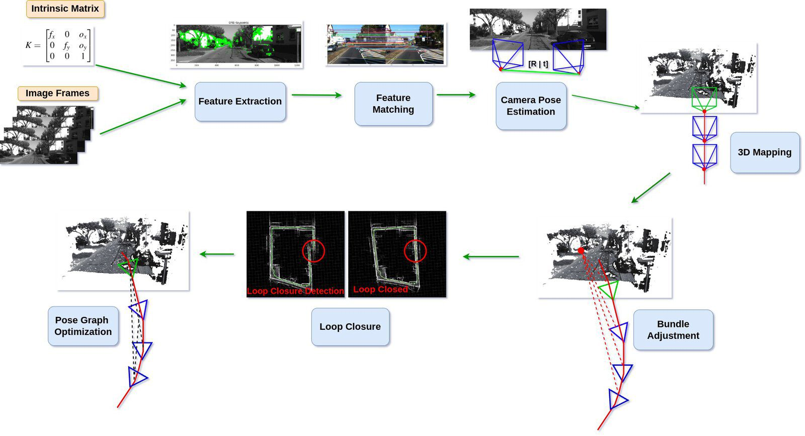 
  <em>Source : <a href="https://learnopencv.com/">LearnOpenCV</a></em>

### Étape 2 : Initialisation et optimisation des Gaussian Splats
Le nuage de points 3D sparse sert à **initialiser une représentation de la scène**. Chaque point est converti en une gaussienne 3D caractérisée par :
sa position dans l'espace, sa taille, son orientation, une opacité et une couleur.
À partir de ces gaussiennes, un moteur d'optimisation sur GPU (typiquement **GSplat**) exécute une boucle d'apprentissage :

1. rend une image de la scène depuis une caméra donnée ;
2. la compare aux images réelles correspondantes ;
3. calcule l'erreur entre le rendu et la réalité ;
4. met à jour les paramètres des gaussiennes pour réduire cette erreur.

Au cours de l’optimisation, la représentation peut également évoluer pour mieux décrire la scène :**
- **Split** : subdiviser des gaussiennes pour mieux représenter les zones complexes ou insuffisamment détaillées.
* **Pruning** : supprimer les gaussiennes peu contributives ou dont l’opacité est trop faible.
* **Culling** : écarter du rendu les éléments qui ne contribuent pas à l’image considérée, par exemple parce qu’ils sont hors du champ de vision.

Ces opérations permettent d’ajuster progressivement la densité et la répartition des gaussiennes en fonction des détails de la scène.

  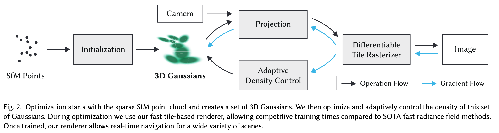 
  <em>Source : <a href="https://zhangtemplar.github.io/3d-gaussian-splatting/">3D Gaussian Splatting for Real-Time Radiance Field Rendering (2023) — Qiang Zhang</a></em>

## 4. Écosystème technologique et outils disponibles

### 4.1 Solutions commerciales fermées

Plusieurs solutions commerciales proposent des logiciels simplifiés de capture, reconstruction et visualisation de Gaussian Splats, visant la facilité d'usage au prix d'un contrôle limité sur les paramètres internes :

| Solution | Type | Open source | Modèle | Usage principal |
|----------|------|-------------|--------|-----------------|
| **Luma AI** | Cloud SaaS | ❌ | Freemium | Capture et reconstruction 3D automatisées (web/mobile) |
| **Polycam** | Application/SaaS | ❌ | Freemium | Capture terrain, photogrammétrie et Gaussian Splats |
| **Scaniverse** | Mobile | ❌ | Gratuit + Pro | Capture mobile et reconstruction 3D |
| **Postshot** | Desktop | ❌ | Freemium | Reconstruction locale de Gaussian Splats |
| **vid2scene** | SaaS/Local | ✅ (Apache 2.0) | Gratuit | Conversion vidéo → Gaussian Splat |

### 4.2 Frameworks et bibliothèques open source

L'écosystème open source constitue le principal moteur d'innovation. Les différents projets couvrent des besoins complémentaires :

| Projet | Type | Entraînement | Visualisation | Pipeline complet |
|--------|------|--------------|---------------|-----------------|
| **3D Gaussian Splatting (GraphDECO)** | Référence académique de l'INRIA | ✅ | ⚠️ | ❌ |
| **GSplat** | Bibliothèque GPU | ✅ | ❌ | ❌ |
| **Nerfstudio** | Framework complet | ✅ | ✅ | ✅ |
| **OpenSplat** | Implémentation légère | ✅ | ⚠️ | ❌ |
| **Spirula** | Framework multi-backends | ✅ | ✅ | ✅ |
Deux frameworks open source complets se distinguent pour les pipelines de production :
-** Nerfstudio** s'appuie sur **GSplat** comme moteur de rasterisation et d'entraînement. GSplat constitue la couche de calcul GPU (CUDA/PyTorch), tandis que Nerfstudio fournit l'ensemble du pipeline (prétraitement, entraînement, gestion des expériences, visualisation, export).
-** Spirula** propose une architecture plus intégrée, avec une interface et le support de données géoréférencées : intégration directe du GPS et du LiDAR . Cette approche facilite le traitement de données calibrées et géolocalisées, répondant directement aux besoins des données IGNF. 
Nerfstudio a constitué la solution principale d'expérimentation dans ces travaux. Spirula ayant été découvert récemment, le recul manque pour une comparaison approfondie au-delà des éléments mentionnés ci-dessus.

---

## 5. Expérimentations réalisées

Les expérimentations qui suivent visent à évaluer comment les Gaussian Splats fonctionnent sur différents types de données géospatiales. Elles ont été menées avec **Nerfstudio** comme solution principale, et en parallèle avec **Spirula** pour comparer les approches.

### 5.1 Choix des frameworks

**Nerfstudio** a été retenu comme solution principale car il s'agit d'un **framework open source complet** permettant de gérer l'ensemble de la chaîne de production des Gaussian Splats, depuis l'acquisition des données jusqu'à la visualisation finale. Il agit comme une **couche d'orchestration** qui assemble plusieurs briques logicielles spécialisées :
- **COLMAP** pour la reconstruction photogrammétrique et l'estimation des poses de caméras
- **GSplat** comme backend d'optimisation GPU pour l'entraînement des Gaussian Splats
- des modules internes pour la gestion des données, l'entraînement et la visualisation

**Spirula** a également été testé pour évaluer les possibilités offertes par une architecture indépendante de CUDA, notamment pour la flexibilité des environnements de calcul et la compatibilité avec des architectures GPU alternatives.

### 5.2 Environnement de calcul

Il est important de préciser que seule la phase d'**entraînement des Gaussian Splats** nécessite des ressources de calcul GPU. Les étapes de reconstruction photogrammétrique (COLMAP / HLOC), de préparation des données et d'export restent entièrement exécutables sur CPU.

Deux environnements de calcul ont été utilisés :

- **Google Colab** : environ 5h de calcul GPU tous les 48h avec un compte gratuit. Performances médiocres et données non pérennes, utilisable pour tests exploratoires sur petites scènes.
- **SLURM sur cluster HPC (Jean-Zellou)** : exécution de pipelines complets et reproductibles sur jeux volumineux, avec GPU NVIDIA A40.

### 5.3 Jeux de données utilisés

Quatre types de données ont été testés pour évaluer la robustesse du pipeline :

1. **Captures smartphone (iPhone 8)** : vidéos autour d'objets simples (arbuste, statue)
2. **PCRS + LiDAR** : orthophotographies aériennes + nuage LiDAR structuré
3. **Drone ISPRS** : 224 images aériennes (7952 × 5304 px, altitude 80m, recouvrement 80%, résolution 1.7 cm/pixel)
4. **Panoramas 360°** : vidéo GoPro Max 2 à vélo (8K équirectangulaire, ~1100 images extraites)

### 5.4 Expérience 1 : Vidéos non structurées

**Objectif :** Valider le fonctionnement du pipeline sur données simples non calibrées.

**Processus :**
1. Extraction des frames via ffmpeg
2. Lancement SfM COLMAP complet
3. Entraînement splatfacto
4. Export et nettoyage du `.ply`

**Résultats :**
- ✓ Reconstruction réussie pour objets simples
- ✓ Navigation fluide en temps réel
- ✗ Artefacts en bords de scène

**Bilan :** Appropriation réussie du pipeline de base. Limitations sur les bords et présence de splats parasites.

### 5.5 Expérience 2 : PCRS + LiDAR

**Objectif :** Exploiter données aériennes géoréférencées avec initialisation LiDAR.

**Processus :**
1. Conversion CON/XML + LiDAR vers format COLMAP (con_laz_to_colmap.py)
2. Sous-échantillonnage des images (résolution très élevée : 26460 × 17004 px)
3. Entraînement avec profils adaptés (PCRS, PCRS2, PCRS3)
4. Nettoyage spatial basé sur géométrie LiDAR

**Résultats :**
- ✓ Reconstruction convaincante de centres-villes (ex. Aubigny-sur-Nère)
- ✓ Restitution fine des détails architecturaux
- ✓ LiDAR aide à stabiliser la géométrie
- ✗ Temps de traitement élevé
- ✗ Gestion difficile de très haute résolution

**Bilan :** Potentiel réel pour valorisation patrimoniale urbaine. Défis : optimisation du sous-échantillonnage, gestion des artefacts de bord.

### 5.6 Expérience 3 : Drone haute-résolution (ISPRS)

**Objectif :** Évaluer reconstruction sur données aériennes bien structurées.

**Données :**
- 224 images aériennes (dataset ISPRS UseGeo)
- Résolution : 7952 × 5304 px
- Altitude : 80 m, recouvrement : 80%, résolution spatiale : 1.7 cm/pixel

**Résultats :**
- ✓ Reconstruction précise à l'échelle métrique
- ✓ Très bonne géométrie fine, peu d'artefacts
- ✓ Couverture homogène et bien contrainte
- ✓ Images bien calibrées => SfM fiable

**Bilan :** Cas d'usage prometteur pour monitoring environnemental et archéologie. La qualité du recouvrement est déterminante. Les données drone standard produisent d'excellents résultats.

### 5.7 Expérience 4 : Paris à vélo (GoPro 360°)

**Objectif :** Tester reconstruction depuis vidéo panoramique 360° en environnement urbain.

**Données :**
- GoPro Max 2 (8K équirectangulaire)
- Capture à vélo dans rue commerçante de Paris
- ~14 sous-images par panoramique, total ~1100 images

**Résultats :**
- ✓ Reconstruction fluide de l'environnement urbain
- ✓ Bonne restitution des façades et détails
- ✗ Splats parasites en arrière-plan
- ✗ Difficultés zones peu texturées (ciel)
- ✗ Manque de variété angulaire (capture linéaire)

**Bilan :** Faisable pour couverture rapide de rues. Limitations : manque de profondeur angulaire, nécessite nettoyage agressif.

---

## 6. Limites observées

À l'issue de ces quatre expériences, plusieurs défis pratiques sont apparus :

- **Temps de traitement** : phases de préparation, d'entraînement et de post-traitement restent coûteuses en temps pour jeux volumineux.

- **Difficultés avec très haute résolution** : sous-échantillonnage des images PCRS (26460 × 17004 px) pose problèmes de mémoire GPU.

- **Maîtrise des bords de scène** : limites de la zone reconstruite difficiles à contrôler, artefacts fréquents en périphérie.

- **Splats parasites** : gaussiennes isolées ou incohérentes en zones peu contraintes, arrière-plans, transitions de profondeur.

- **Difficulté d'évaluation objective** : reste difficile de quantifier la qualité finale et d'identifier paramètres optimaux.

- **Dépendance forte à la configuration de prise de vue** : meilleurs résultats avec bon recouvrement (80%+), angles variés, couverture homogène. Qualité se dégrade avec angles peu variés ou couverture insuffisante.

---

## 7. Bilan et perspectives

### 7.1 Synthèse des résultats

Les quatre expériences confirment que **les Gaussian Splats constituent une piste crédible pour la représentation photoréaliste** à condition que les données respectent certaines conditions :

| Contexte | Résultats | Prérequis clés |
|----------|-----------|----------------|
| **Vidéos simples** | Bons (objets, petites scènes) | Bonne couverture angulaire |
| **PCRS + LiDAR** | Convaincants (urbain) | Sous-échantillonnage, profils adaptés |
| **Drone ISPRS** | Excellents (milieux ouverts) | Recouvrement 80%, résolution 1.7 cm/px |
| **Panoramas 360°** | Acceptables (rues) | Extraction multi-images, nettoyage agressif |

### 7.2 Travaux complémentaires nécessaires

**Court terme :**
- Stabiliser les profils d'entraînement selon types de données
- Optimiser l'injection du LiDAR dans le calcul des gaussiennes
- Améliorer le nettoyage et la gestion des artefacts de bord

**Moyen terme :**
- Évaluer la pertinence par type de données (coût/qualité/temps)
- Concevoir des workflows de capture optimisés
- Prototyper des outils de visualisation web

### 7.3 Recommandations

L'IGNF devrait :

1. Poursuivre l'expérimentation sur d'autres jeux de données
2. Investir dans l'optimisation des pipelines
3. Explorer les nouveaux usages (consultation immersive, monitoring temporel, services à la demande)
4. Assurer la veille sur évolutions technologiques et standards (glTF, 3D Tiles, Spirula, Nerfstudio)

> **Conclusion :** Les Gaussian Splats offrent une réelle opportunité pour valoriser nos données.
> Les travaux menés ont montré la faisabilité, mais des efforts d'optimisation demeurent nécessaires
> avant un passage à l'échelle.
--
## 4. Expérimentations réalisées

Les expérimentations qui suivent visent à évaluer comment les Gaussian Splats fonctionnent sur différents types de données géospatiales. Elles ont toutes été menées avec **Nerfstudio**, un framework open source complet qui orchestre l'ensemble de la chaîne (COLMAP, GSplat, visualisation).

### 4.1 Expérience 1 : Vidéos non structurées

**Objectif :** Valider le fonctionnement du pipeline sur des données simples et non calibrées.

**Données :**
- Captures smartphone (iPhone 8) : vidéos prises en tournant autour d'objets
- Pas d'orientation pré-estimée, nécessite une reconstruction SfM complète

**Processus :**
1. Extraction des frames via ffmpeg
2. Lancement du pipeline Nerfstudio (SfM COLMAP + entraînement splatfacto)
3. Export du `.ply` final

**Résultats :**
- ✓ Reconstruction réussie pour objets simples (arbuste, statue)
- ✓ Navigation fluide en temps réel
- ✗ Difficultés sur les bords de scène (artefacts périphériques)

<table>
  <tr>
    <th colspan="3">Arbuste sous différents angles</th>
  </tr>
  <tr>
    <td align="center">
      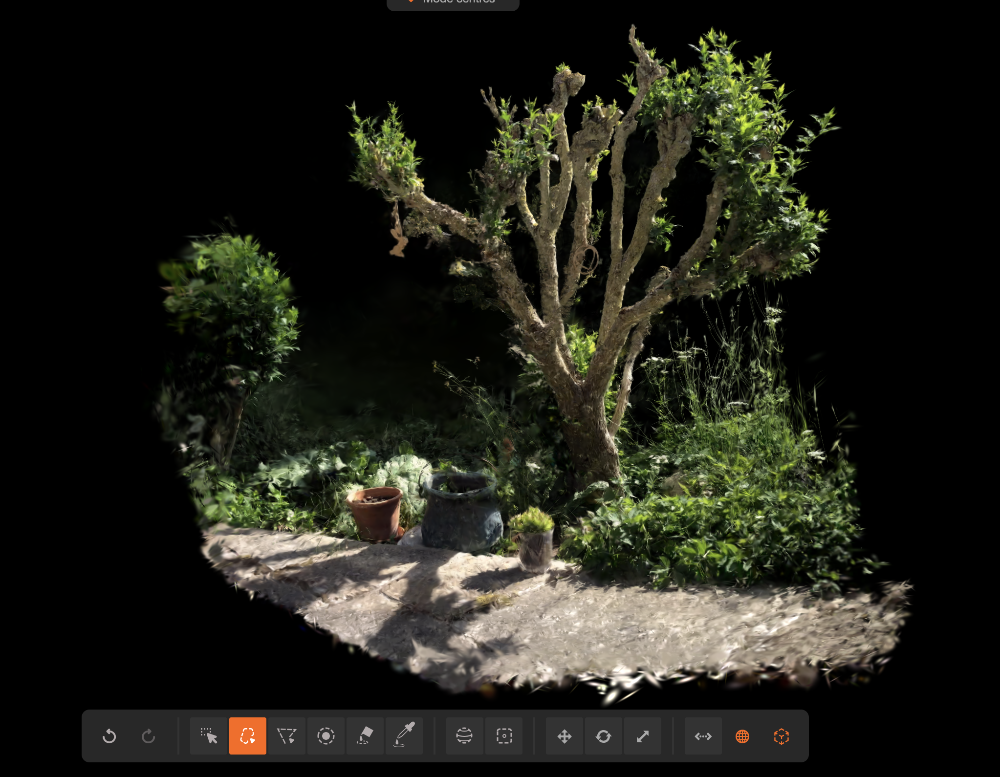 
      Vue 1
    </td>
    <td align="center">
      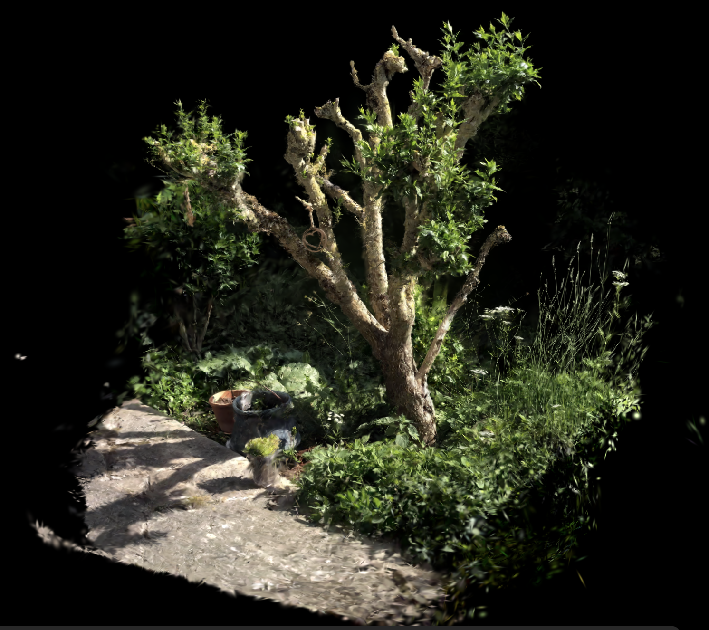 
      Vue 2
    </td>
    <td align="center">
      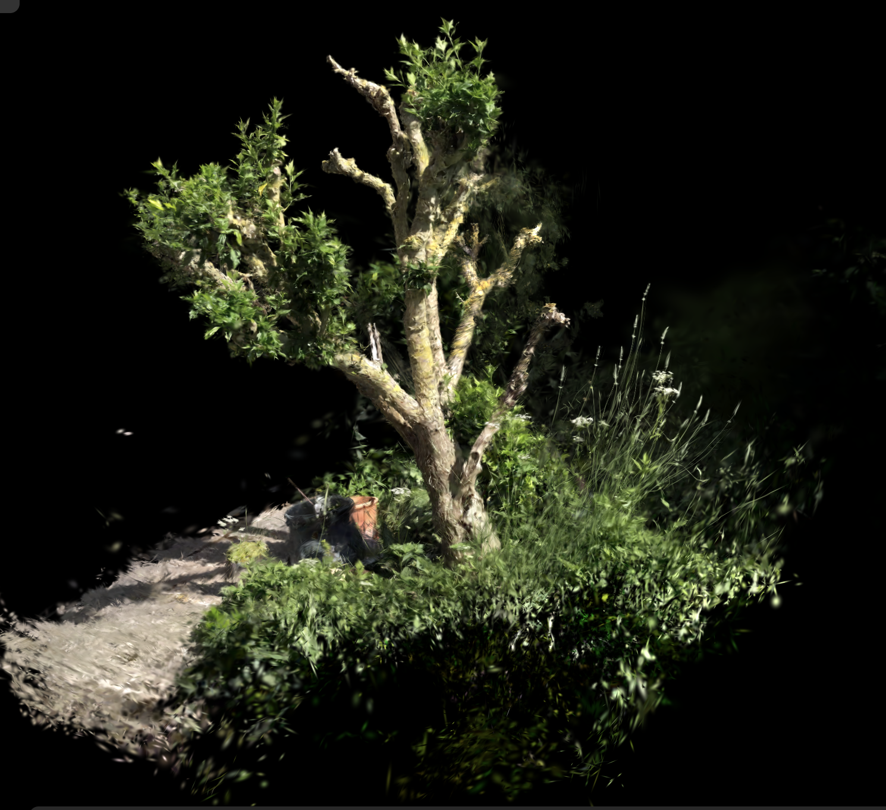 
      Vue 3
    </td>
  </tr>
</table>

<table>
  <tr>
    <th colspan="3">Statue sous différents angles</th>
  </tr>
  <tr>
    <td align="center">
      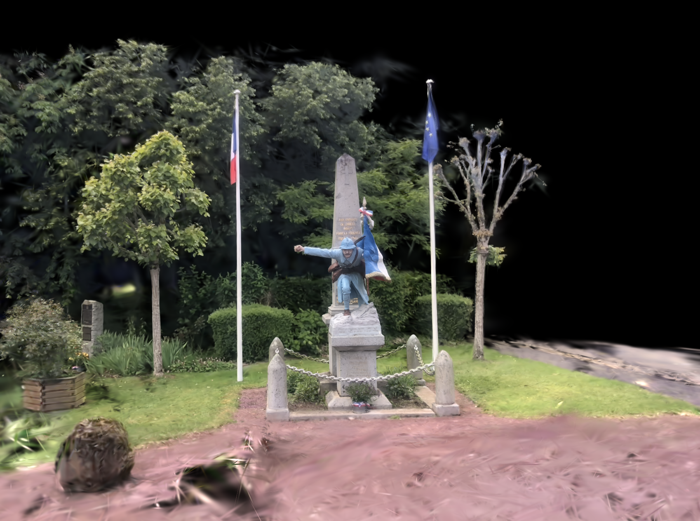 
      Vue 1
    </td>
    <td align="center">
      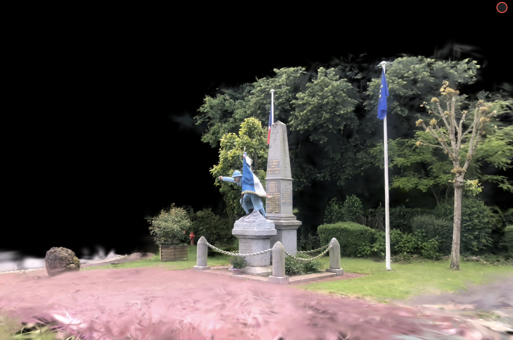 
      Vue 2
    </td>
    <td align="center">
      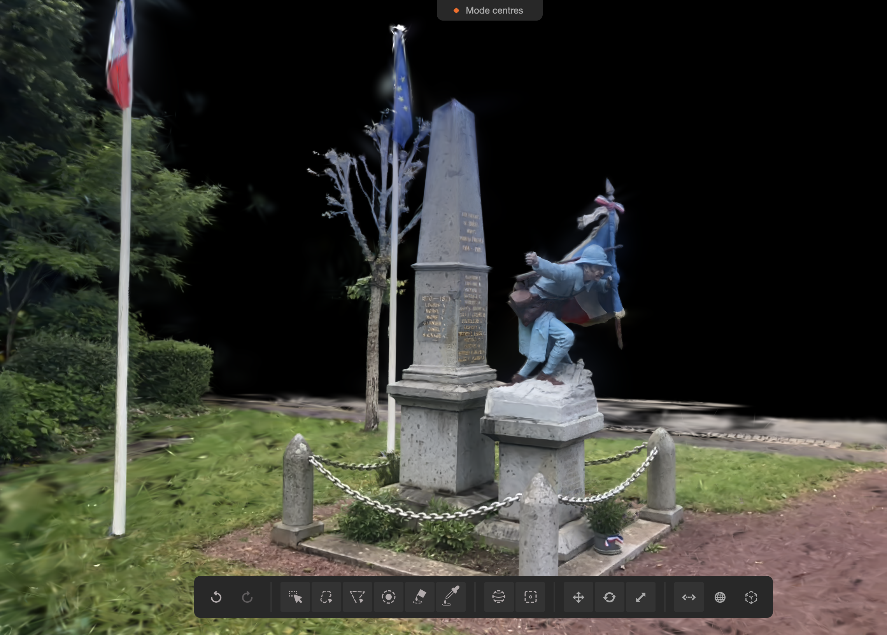 
      Vue 3
    </td>
  </tr>
</table>

**Bilan :** Appropriation réussie du pipeline de base. Limitations observées : artefacts en bord de scène, présence de splats parasites.

---

### 4.2 Expérience 2 : PCRS + LiDAR

**Objectif :** Exploiter des données aériennes géoréférencées avec initialisation LiDAR.

**Données :**
- Images PCRS (orthophotographies haute résolution)
- Nuage de points LiDAR géoréférencé
- Orientations CON/XML pré-estimées

**Processus :**
1. Conversion des données vers format COLMAP/Nerfstudio (con_laz_to_colmap.py)
2. Initialisation avec le LiDAR
3. Sous-échantillonnage des images (résolution extrêmement élevée : 26460 × 17004 px)
4. Entraînement avec profil adapté (PCRS, PCRS2, PCRS3)
5. Nettoyage spatial basé sur la géométrie LiDAR

**Résultats :**
- ✓ Reconstruction convaincante de centres-villes (ex. Aubigny-sur-Nère)
- ✓ Restitution fine des détails architecturaux
- ✓ LiDAR aide à stabiliser la géométrie
- ✗ Temps de traitement élevé
- ✗ Gestion difficile de la très haute résolution

<table>
  <tr>
    <th colspan="3">Centre-ville d'Aubigny-sur-Nère (Cher)</th>
  </tr>
  <tr>
    <td align="center">
      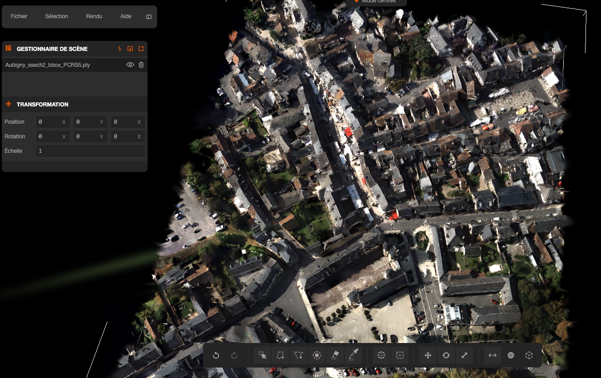 
      Vue 1
    </td>
    <td align="center">
      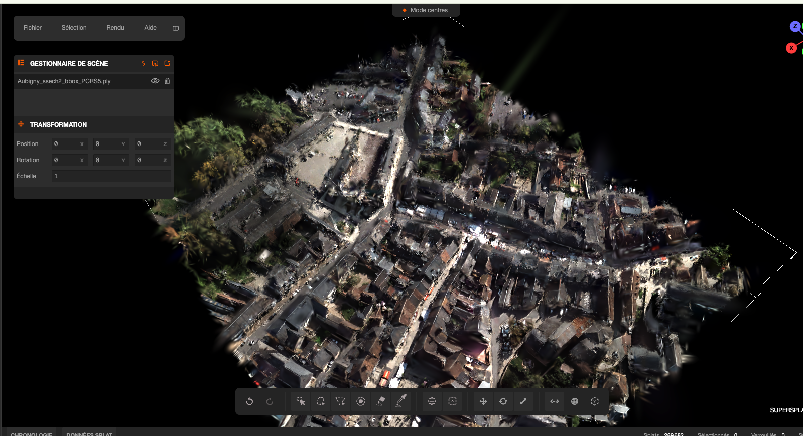 
      Vue 2
    </td>
    <td align="center">
      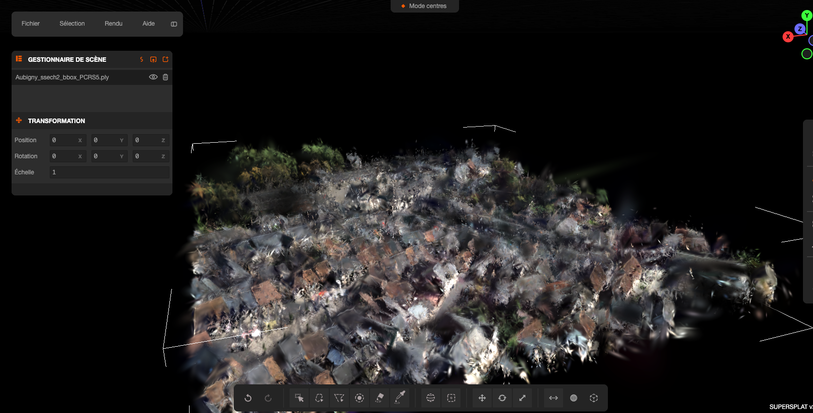 
      Vue 3
    </td>
  </tr>
</table>

**Bilan :** Potentiel réel pour la valorisation du patrimoine urbain. Le LiDAR améliore la stabilité. Défis : optimisation du sous-échantillonnage, gestion des artefacts de bord.

---

### 4.3 Expérience 3 : Drone haute-résolution (ISPRS)

**Objectif :** Évaluer la reconstruction sur données aériennes bien structurées.

**Données :**
- 224 images aériennes (dataset ISPRS UseGeo)
- Résolution : 7952 × 5304 px
- Altitude : 80 m
- Recouvrement : 80% avant / 60% latéral
- Résolution spatiale : 1.7 cm/pixel
- Zone couverte : ~1100 × 650 m

**Processus :**
1. Lancement SfM COLMAP sur l'ensemble des images
2. Entraînement splatfacto (profil "quality" ou "balanced")
3. Export et nettoyage

**Résultats :**
- ✓ Reconstruction précise à l'échelle métrique
- ✓ Restitution fidèle des zones agricoles et des détails fins
- ✓ Très bonne couverture géométrique
- ✓ Peu d'artefacts grâce au bon recouvrement
- ✓ Images bien calibrées => SfM fiable

<table>
  <tr>
    <th colspan="3">Données drones ISPRS</th>
  </tr>
  <tr>
    <td align="center">
      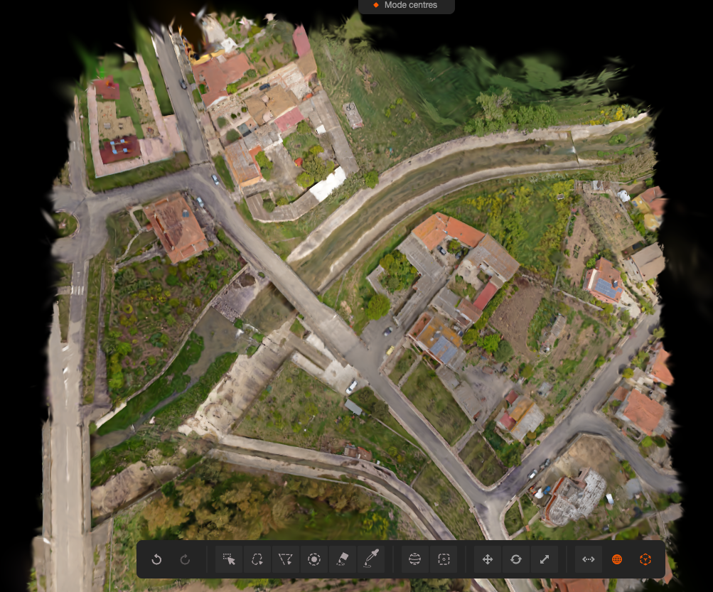 
      Vue 1
    </td>
    <td align="center">
      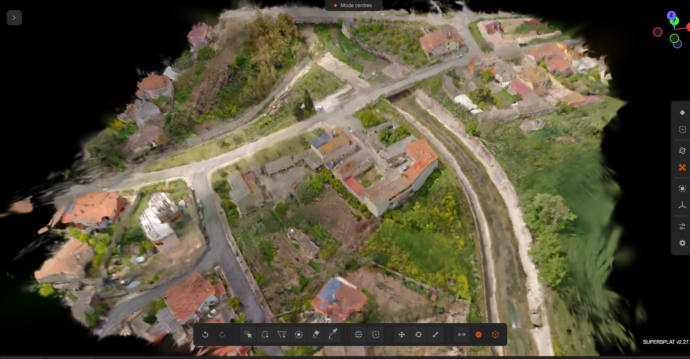 
      Vue 2
    </td>
    <td align="center">
      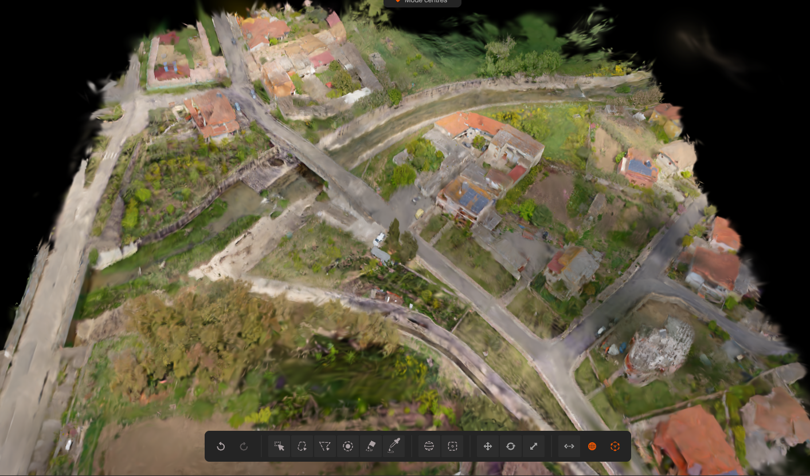 
      Vue 3
    </td>
  </tr>
</table>

**Bilan :** Cas d'usage prometteur pour le monitoring environnemental et l'archéologie. La qualité du recouvrement est déterminante. Les données drone standard produisent d'excellents résultats.

---

### 4.4 Expérience 4 : Paris à vélo (GoPro 360°)

**Objectif :** Tester la reconstruction depuis vidéo panoramique 360° en environnement urbain.

**Données :**
- Vidéo GoPro Max 2 (2 capteurs, 8K équirectangulaire)
- Capture à vélo dans une rue commerçante de Paris
- ~14 sous-images extraites par panoramique
- Total : ~1100 images

**Processus :**
1. Extraction des images depuis le panorama 8K (14 par pano)
2. Lancement SfM COLMAP sur l'ensemble
3. Entraînement splatfacto
4. Export

**Résultats :**
- ✓ Reconstruction fluide de l'environnement urbain
- ✓ Bien-être de la navigation le long de la rue
- ✓ Restitution des façades, vitrines, détails urbains
- ✗ Présence de splats parasites en arrière-plan
- ✗ Difficultés avec les zones peu texturées (ciel)
- ✗ Manque de variété angulaire (capture linéaire)

<table>
  <tr>
    <th colspan="3">Rue de Paris (Panos GoPro 8k)</th>
  </tr>
  <tr>
    <td align="center">
      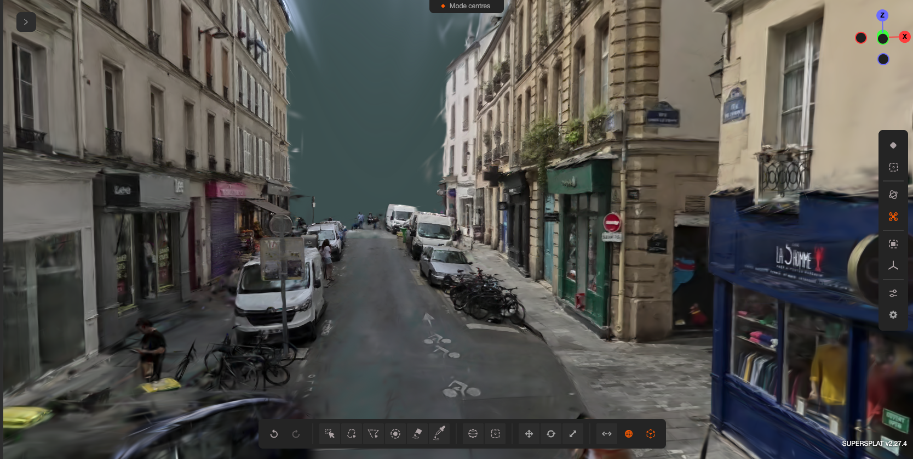 
      Vue 1
    </td>
    <td align="center">
      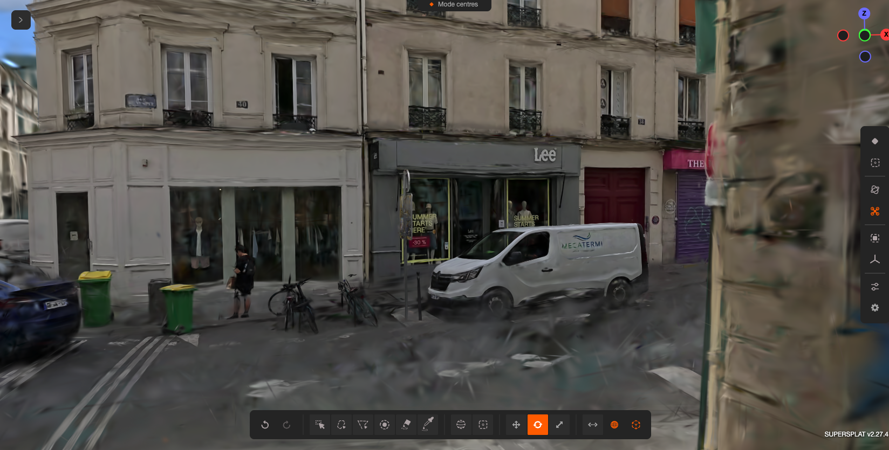 
      Vue 2
    </td>
    <td align="center">
      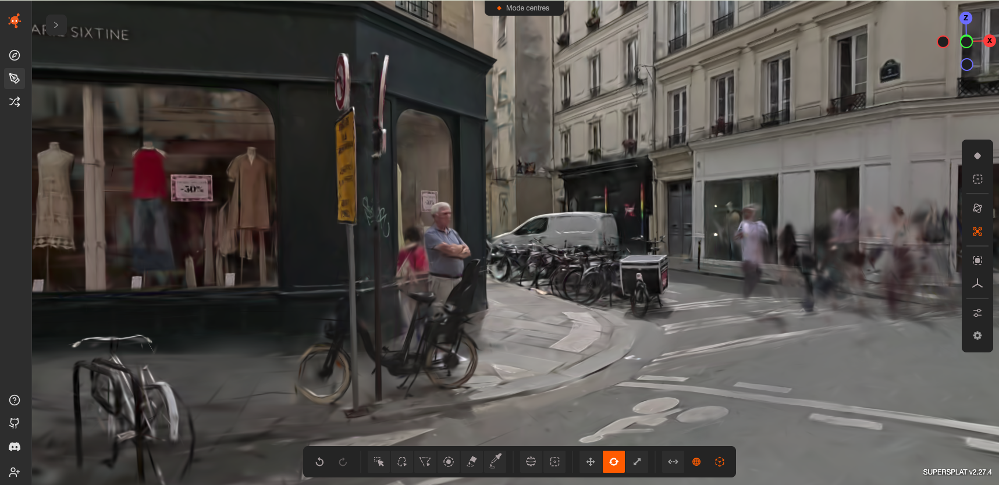 
      Vue 3
    </td>
  </tr>
</table>

**Bilan :** Faisable pour une couverture rapide de rues. Limitations : manque de profondeur angulaire, artefacts en arrière-plan. Nécessite un traitement de nettoyage plus agressif.

---

## 5. Limites observées

À l'issue de ces quatre expériences, plusieurs défis pratiques sont apparus :

- **Temps de traitement** : malgré l'optimisation GPU, les phases de préparation, d'entraînement et de post-traitement restent coûteuses en temps, surtout pour les jeux volumineux.

- **Difficultés avec les images de très haute résolution** : le sous-échantillonnage des images PCRS (26460 × 17004 px) pose des problèmes de charge mémoire GPU.

- **Maîtrise des bords de scène** : les limites de la zone reconstruite restent délicates à contrôler. On observe fréquemment des artefacts en périphérie.

- **Présence de splats parasites** : certaines reconstructions font apparaître des gaussiennes isolées ou incohérentes, en particulier dans les zones peu contraintes ou aux transitions de profondeur.

- **Dépendance forte à la configuration de prise de vue** : les meilleurs résultats sont obtenus avec un **bon recouvrement** (80%+), des **angles variés** et une **couverture homogène**. La qualité se dégrade nettement lorsque ces conditions ne sont pas réunies.

- **Difficulté d'évaluation objective** : il reste difficile de quantifier la qualité finale et d'identifier les paramètres optimaux. Le lien entre réglages, qualité visuelle et stabilité n'est pas toujours évident.

---

## 6. Bilan et perspectives

### 6.1 Synthèse des résultats

Les quatre expériences confirment que **les Gaussian Splats constituent une piste crédible pour la représentation photoréaliste de scènes 3D dans des contextes géospatiaux**, à condition que les données respectent certaines conditions :

| Contexte | Résultats | Prérequis clés |
|----------|-----------|----------------|
| **Vidéos simples** | Bons (objets, petites scènes) | Bonne couverture angulaire |
| **PCRS + LiDAR** | Convaincants (urbain) | Sous-échantillonnage, profils adaptés |
| **Drone ISPRS** | Excellents (milieux ouverts) | Recouvrement 80%, résolution 1.7 cm/px |
| **Panoramas 360°** | Acceptables (rues) | Extraction multi-images, nettoyage agressif |

### 6.2 Travaux complémentaires nécessaires

**Court terme :**
- Stabiliser les profils d'entraînement (balanced, quality, PCRS) selon les types de données
- Optimiser l'injection du LiDAR dans le calcul des gaussiennes
- Améliorer le nettoyage et la gestion des artefacts de bord

**Moyen terme :**
- Évaluer la pertinence par type de données (coût / qualité / temps)
- Concevoir des workflows de capture optimisés pour chaque contexte
- Prototyper des outils de visualisation web

### 6.3 Recommandations

L'IGNF devrait :

1. **Poursuivre l'expérimentation** sur d'autres jeux de données (zones urbaines denses, patrimoine, sites d'étude)
2. **Investir dans l'optimisation** des pipelines de préparation et de nettoyage
3. **Explorer les nouveaux usages** : consultation immersive, monitoring temporel, services à la demande
4. **Assurer la veille** sur les évolutions technologiques et les standards (glTF, 3D Tiles)

> **Conclusion :** Les Gaussian Splats offrent une réelle opportunité pour valoriser nos données
> et proposer de nouvelles expériences utilisateur. Les travaux menés ont montré la faisabilité,
> mais des efforts d'optimisation et de caractérisation demeurent nécessaires avant un passage à l'échelle.
