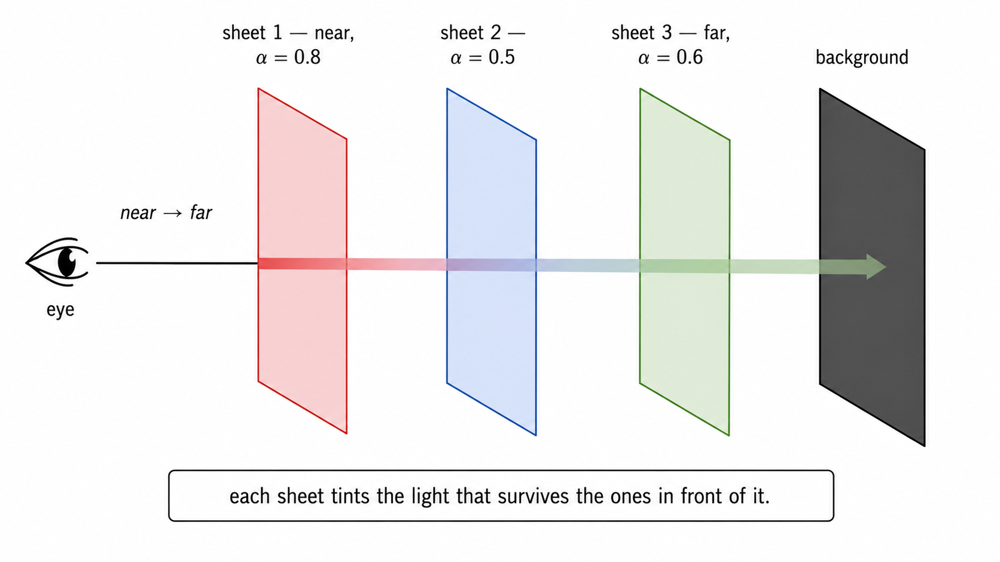

# Des données géoréférencées aux splats gaussiens
## Une nouvelle manière de représenter et de visualiser nos données en 3D

---

## 1. Un Gaussian Splat, c'est quoi ?

### Les différentes manières de représenter une scène 3D

Pour représenter une scène en trois dimensions, on utilisait en général :
- **un maillage texturé** : une surface composée de triangles, sur laquelle sont projetées des images
- **un nuage de points** : des positions 3D, éventuellement accompagnées de couleurs

Récemment, deux approches paramétriques modernes se sont imposées :
1- **Les NeRF (Neural Radiance Fields)** :  un réseau neuronal encode la radiance (couleur + luminosité) en fonction de la position et de la direction d'observation.
- ✓ Qualité visuelle exceptionnelle
- ✗ Rendu très lent (secondes par image)

2- L**es 3D Gaussian Splatting** : la scène est décrite par un ensemble de **gaussiennes 3D** : des ellipsoïdes colorés avec une certaine opacité.

Chaque gaussienne possède :

  - une **position** dans l'espace ;
  - une **échelle** et une **rotation**, qui définissent sa forme et son orientation ;
  - une **opacité** ;
  - des **attributs de couleur**, pouvant représenter une apparence qui varie selon la direction d'observation.

   
  <em>Source : <a href="https://brunzema.github.io/visualizations/gaussian-splatting">A visual exploration of Gaussian Splatting — Paul Brunzema</a></em>

Le rendu peut alors se faire en **temps réel.**

### Comment obtient-on une image ?
L’idée est de remplacer les points ou les triangles par de petites taches volumétriques. Vues individuellement, elles ne ressemblent pas à grand-chose ;
projetées et combinées, elles peuvent restituer une image très détaillée.

Les gaussiennes sont projetées sur l’écran puis leurs contributions sont combinées pour former l’image.
Leur forme et leur transparence permettent de produire un rendu continu, sans construire explicitement une surface triangulée.

   
  <em>Source : <a href="https://github.com/Chamud/3DGS-101">3DGS-101 — Chamud</a></em>

Chaque Gaussian possède une opacité intrinsèque \(\alpha\), apprise pendant l'entraînement et stockée avec le splat. Le moteur de rendu calcule ensuite l'opacité effective de chaque pixel en fonction de sa distance au centre du splat, selon la courbe gaussienne. 
Ainsi, un splat avec \(\alpha=0.8\) aura une opacité proche de \(0.8\) au centre, mais progressivement plus faible vers les bords. C'est cet alpha effectif \(a(x)\) qui intervient dans le compositing : pour chaque pixel, le moteur parcourt les splats dans la direction de la caméra vers la scène, du plus proche au plus éloigné. Le premier contribue avec \(a_1\), le deuxième avec \(a_2(1-a_1)\), le troisième avec \(a_3(1-a_1)(1-a_2)\), etc.

---

## 2. Comment passe-t-on des images aux splats ?
### Durée indicative : 1 min

### Un apprentissage de l’apparence de la scène

Le principe consiste à disposer :

1. d’**images de la scène**, prises depuis plusieurs points de vue ;
2. des **paramètres des caméras** : position, orientation et paramètres internes ;
3. d’une **géométrie initiale**, par exemple un nuage de points.

Le modèle produit des images depuis les points de vue des caméras.
Ces images sont comparées aux photographies d’origine.

Les paramètres des gaussiennes sont ensuite ajustés progressivement pour réduire les différences :

- position et forme ;
- opacité ;
- couleur ;
- nombre et répartition des gaussiennes, selon la méthode utilisée.

### Deux étapes à distinguer

- **L’entraînement** : calculer et optimiser la représentation de la scène.
- **La visualisation** : afficher la représentation déjà entraînée depuis un nouveau point de vue.

Le 3D Gaussian Splatting, popularisé par les travaux de 2023, se distingue notamment par la possibilité d’un **rendu interactif**, selon la taille de la scène et le matériel utilisé.

> **Message clé :** on investit du calcul pour construire la représentation,
> afin de pouvoir ensuite naviguer dans la scène de manière fluide.

**Visuel conseillé :**
Images + caméras + points 3D → optimisation → scène navigable.

---

## 3. Pourquoi s’y intéresser dans notre contexte ?
### Durée indicative : 1 min 15

### Valoriser les données dont nous disposons déjà

Nos jeux de données géographiques peuvent réunir :

- des **images aériennes à haute résolution** ;
- leurs **orientations et paramètres de caméra** ;
- des **nuages de points LiDAR géoréférencés**.

Ces données apportent deux informations complémentaires :

- les images décrivent principalement **l’apparence** de la scène ;
- le LiDAR fournit une **géométrie mesurée**, utile pour initialiser la représentation.

L’intérêt est donc d’explorer comment transformer ces données existantes en une représentation 3D permettant une consultation visuelle immersive et interactive.

### Un objectif complémentaire aux produits classiques

Les splats gaussiens peuvent être intéressants pour :

- restituer l’apparence d’un territoire depuis différents points de vue ;
- faciliter l’exploration visuelle des données ;
- proposer des démonstrateurs accessibles dans un viewer compatible ;
- étudier une alternative ou un complément aux maillages texturés.

Il ne s’agit pas de considérer qu’ils remplacent automatiquement les autres représentations.

Un nuage LiDAR, un maillage et un modèle de splats ne répondent pas exactement aux mêmes besoins.

> **Message clé :** l’enjeu est de valoriser nos données géographiques
> dans une nouvelle représentation visuelle, et d’en évaluer l’intérêt réel.

**À l’oral :**
« Nous ne partons pas uniquement de photographies : nous disposons déjà
d’orientations et d’une géométrie LiDAR. La question est de savoir comment
exploiter ces acquis pour produire une autre manière de voir nos données. »

---

## 4. Notre approche : des données métier à une scène visualisable
### Durée indicative : 1 min 15

### Le rôle du pipeline `aerial_data_to_gaussian_splats`

Le pipeline développé relie les données géoréférencées aux outils d’entraînement et de visualisation des splats gaussiens.

### Étape 1 — Préparer les données

**Entrées :**

- images orientées au format **IGNF CON/XML** ;
- nuage de points **LiDAR au format `.laz`**.

Les images, les paramètres caméra et les points LiDAR sont convertis vers une structure compatible avec **COLMAP et Nerfstudio**.

Cette préparation comprend notamment :

- le sous-échantillonnage des images et du LiDAR ;
- la conversion des paramètres caméra ;
- la reprojection des points LiDAR dans les images ;
- la production des fichiers nécessaires à l’entraînement.

**Particularité importante :**
dans cette voie de traitement, on ne réestime pas les orientations par une reconstruction photogrammétrique classique à partir de correspondances entre images.

On exploite **des orientations déjà connues et un nuage LiDAR existant**.

### Étape 2 — Entraîner et exporter

Le pipeline :

- estime les limites proches et lointaines utiles à l’entraînement ;
- entraîne un modèle **`splatfacto` de Nerfstudio** ;
- exporte les gaussiennes ;
- applique un nettoyage spatial fondé sur la proximité à la géométrie de référence.

La préparation des données ne nécessite pas de GPU.
L’entraînement est réalisé sur GPU, dans un environnement prévu notamment pour des exécutions sur serveur ou cluster Slurm.

### Le livrable : un `.ply` enrichi

Le résultat est un fichier **`.ply` contenant les paramètres des gaussiennes** :
positions, échelles, rotations, opacités et attributs d’apparence.

Ce n’est donc **pas un simple nuage de points**, même si l’extension est identique.

Il peut être ouvert dans un outil compatible avec les Gaussian Splats, comme **SuperSplat**.

**Visuel conseillé :**
Images orientées + LiDAR → conversion COLMAP/Nerfstudio
→ entraînement → export et nettoyage → viewer.

---

## 5. Le point de vigilance à garder en tête
### Durée indicative : 30 s

### Qualité visuelle et qualité géométrique ne sont pas équivalentes

Une scène peut être visuellement convaincante sans que sa géométrie soit suffisamment exacte pour un usage de mesure.

Inversement, une géométrie bien mesurée ne garantit pas un rendu satisfaisant depuis tous les points de vue.

L’utilisation du LiDAR comme initialisation et référence de nettoyage est un atout, mais elle ne suffit pas à garantir l’exactitude géométrique du modèle final.

Il faut donc distinguer :

- la **fidélité visuelle** aux images ;
- la **cohérence géométrique** ;
- la **couverture des points de vue** ;
- les **performances de calcul et de visualisation**.

> **Conclusion de l’introduction :**
> les splats gaussiens constituent une piste prometteuse pour la visualisation
> de nos données. Nos travaux visent à comprendre comment les produire à partir
> de nos jeux de données, avec quelles qualités et quelles limites.
